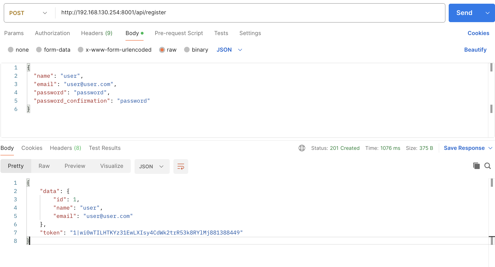
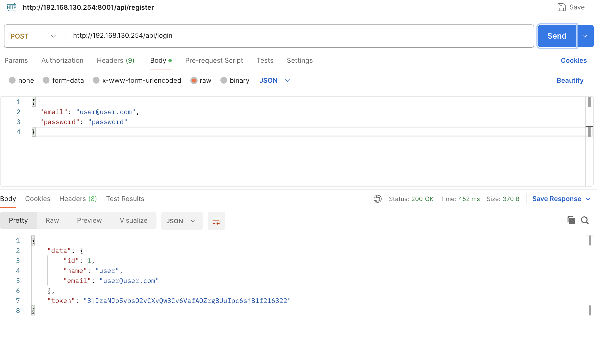
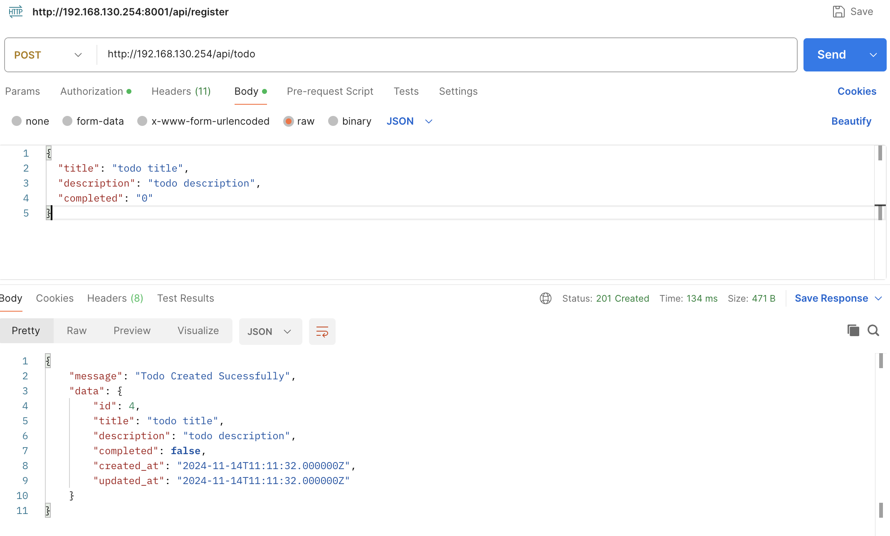
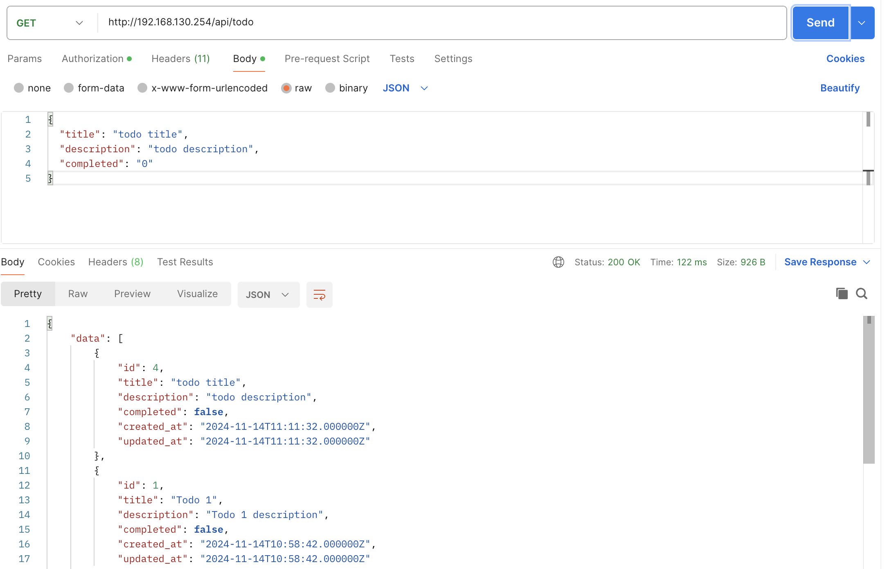
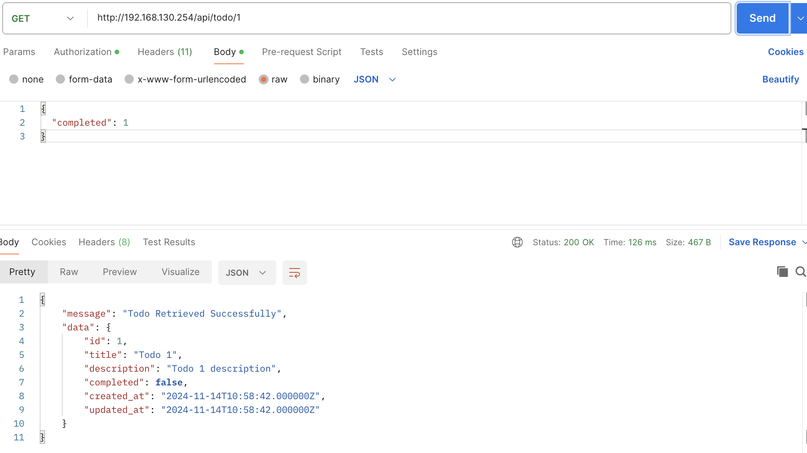
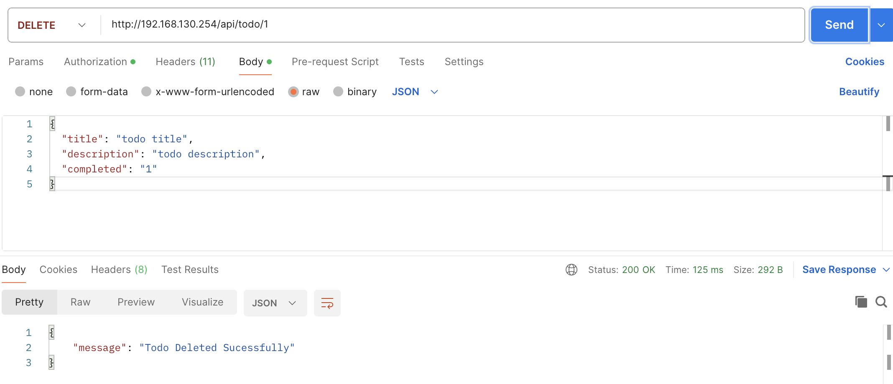

## Answer/Solutions:
### For local development.
1. **Dockerize the Application: Create a Docker Compose file to set up the application for local development. Do not use pre-built solutions like Sail or Larasail.**


   Please check Dockerfile on root dir.
   - I have created Laravel php-8.2 base-image with common dependencies and saved on self-hosted nexus docker registry. [15min]
   - I have created created Multi-stage Dockerfile for todo app. [15min]
   - I have created docker-compose.yml file to build and run todo app, postgres database, redis and nginx container. All are in same todo-network. For database and redis, there is volume mount for presistance volume. [15min]
   - Future work: build docker image for todo-app and upload on docker registry to reduce build time. 
2. **Database and Caching Configuration: Configure database and caching services within the Docker environment.**

   Please note docker-compose.yml on root dir.
   - I have created postgres database and redis using docker compose. [15min]
### For deployment
1. **Remote Server Setup: Use Vagrant, Multipass, or similar virtualization tools to set up a remote server.** [30min]

- I have created Ubuntu 22.4 VM using ESXI, with 3core CPU and 6GB Memory, and Static IP.
2. **Self-Hosted Runner: Set up a GitHub or Bitbucket self-hosted runner.**[20min]

   - I have created Ubuntu 22.4 VM and setup self-hosted runner.
   ```
   mkdir actions-runner && cd actions-runner
   curl -o actions-runner-linux-x64-2.308.0.tar.gz -L https://github.com/actions/runner/releases/download/v2.308.0/actions-runner-linux-x64-2.308.0.tar.gz
   tar xzf ./actions-runner-linux-x64-2.308.0.tar.gz
   ./config.sh --url https://github.com/binod132/laravel-todolist-api --token AL4P4SQHQH5ILPF42ZIT75DHFXKAA
   sudo ./svc.sh install
   sudo ./svc.sh start
   sudo ./svc.sh status
   ```
   - Use self-hosted runner in gitaction.
   ```
   jobs:
   deploy:
    runs-on: self-hosted 
   ```
3. **CI/CD Pipeline: Implement a CI/CD pipeline with GitHub Actions or Bitbucket Pipelines, including build, test, and deployment stages. Use the self-hosted runner for this pipeline.**

   Please refer to .github/workflows/deploy.yaml action file.
   - I have created github action file as CICD. It SSH to remote host, pull github repo and run docker compose down and up. Docker compose file builds and run containers for todo-app, redis, postgres, nginx. [1hr]
   - Future work, use docker registry to upload pre-build docker image, and use trivy/sonar on CICD to scan image.
4. **Deployment: Deploy the application to a remote server without Docker using a web server (e.g., Nginx) and a PHP processor (e.g., PHP-FPM). This deployment should occur from your GitHub or Bitbucket pipeline using the self-hosted runner.**

   Please refer to above step 3.
5. **Infrastructure Automation: Write Infrastructure as Code (IaC) or an Ansible playbook to automate the setup of the remote server, including all dependencies.**

   - I have used ansible to provision Linux VM on ESXI, it creates the custom OS, using .vmx file. Please refer to ansible/autoinstall.yml [1hr]
   - I have used ansible to automate dependencies installation including docker and docker compose. Please refer to ansible/docker.yml [30min]
6. **Documentation** [1hr]

## Bonus Tasks (Optional):

   **Enhanced environment/secret variable management using a secret manager.**


   - git repository secret: I have used github repository secret. For DB credentials and other secret we can use open-source vaults like Hashicorp Vault
   - Harshicorp Vault: I have used Hashicorp Vault to store secret like DB password. I have install vault on VM, created DB password, created VaultService class, and updated database.php to extract DB password from vault using VaultService class.


   **Implement zero-downtime deployment.**
   - Rolling Update: I have created rolling update like deployment by creating two containers for todo-app. In workflows/rollingupdate.yaml, during deployment, first todo-app-1 will stop then new todo-app-1 is created and during this traffics are redirected towards todo-app-2.

   **Include additional Laravel tools.**

   I have add following additional tools.
   - csharpru/vault-php: To manage secrets.
   - squizlabs/php_codesniffer: For code analysis.

   **Add code linting to the pipeline..**

   I have used php_codesniffer to test code quality on CICD pipeline. We can stop build process if code test is below defined threshold.


# Laravel To-Do List API.

A simple To-Do list API built with Laravel.

## Setup Instructions

Follow these steps to get the application up and running.

### Prerequisites

- MySQL Server
- Redis Server
- PHP 8.3
- PHP Composer

### Installation Steps

1. **Create MySQL and Redis servers**

   Ensure that you have MySQL and Redis servers set up and running.

2. **Copy `.env` file**

   ```bash
   cp .env.example .env
   ```

3. **Update `.env` file**

   Update the `.env` file with your environment-specific details, such as database credentials and Redis connection.

4. **Install Dependencies**

   ```bash
   composer install
   ```

5. **Generate Application Key**

   ```bash
   php artisan key:generate
   ```

6. **Run Database Seeder**

   ```bash
   php artisan db:seed
   ```

7. **Serve site with herd or valet or nginx**

    #### herd example
    ```bash
   herd domain test
   herd link laravel-todolist-api
   herd secure --site=laravel-todolist-api
   ```
   
Follow official documentation for nginx configuration and valet.

### Verify Application Functionality

You can test the application using the following HTTP requests:

#### 1. Register

**Request:**

```http
POST https://laravel-todolist-api.test/api/register
Content-Type: application/json

{
  "name": "user",
  "email": "user@user.com",
  "password": "password",
  "password_confirmation": "password"
}
```

#### 2. Login

**Request:**

```http
POST https://laravel-todolist-api.test/api/login
Content-Type: application/json

{
  "email": "user@user.com",
  "password": "password"
}
```

#### 3. Create To-Do Item

**Request:**

```http
POST https://laravel-todolist-api.test/api/todo
Authorization: Bearer YOUR_ACCESS_TOKEN
Content-Type: application/json

{
  "title": "todo title",
  "description": "todo description",
  "completed": "0"
}
```

#### 4. List To-Do Items

**Request:**

```http
GET https://laravel-todolist-api.test/api/todo
Authorization: Bearer YOUR_ACCESS_TOKEN
Content-Type: application/json
```

#### 5. To-Do Item Detail

**Request:**

```http
GET https://laravel-todolist-api.test/api/todo/1
Authorization: Bearer YOUR_ACCESS_TOKEN
Content-Type: application/json

{
  "completed": 1
}
```

#### 6. Update To-Do Item

**Request:**

```http
PATCH https://laravel-todolist-api.test/api/todo/1
Authorization: Bearer YOUR_ACCESS_TOKEN
Content-Type: application/json

{
  "title": "todo title",
  "description": "todo description",
  "completed": "1"
}
```

#### 7. Delete To-Do Item

**Request:**

```http
DELETE https://laravel-todolist-api.test/api/todo/1
Authorization: Bearer YOUR_ACCESS_TOKEN
Content-Type: application/json
```
